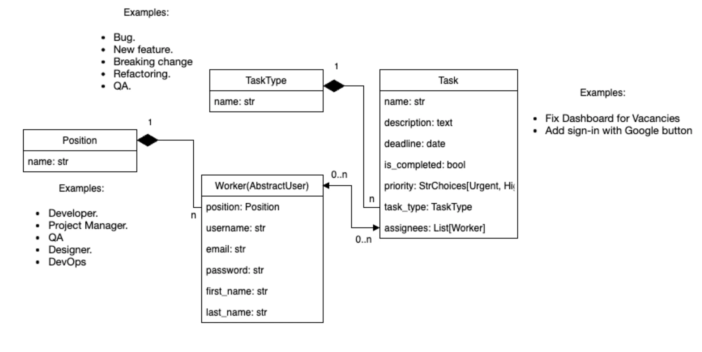

# ItTaskManager
A Django-based application for efficient task tracking, assignment, and project management within IT teams.

```shell
   info about superuser:
   Login: krixn
   Password: 738059
```

# Feel free to use it 

### [ittaskmanager-2.onrender.com](https://ittaskmanager-2.onrender.com)

# This is sctructure for project:



## Installation

Python3+ must be already installed

```shell

git clone https://github.com/shaiduchyk/ItTaskManager.git

## For Windows:

py -m venv venv
venv/scripts/activate

## For MacOS

python3 -m venv venv
source venv/bin/activate 

pip install -r requirements.txt
py manage.py runserver

```

ItTaskManager is a web application built with Django, designed to streamline task management within IT teams. The application facilitates task creation, assignment, and project tracking, providing a user-friendly interface for efficient collaboration.

## Features

- **Task Management:** Create, assign, and track tasks with ease.
- **Project Tracking:** Monitor project progress and deadlines.
- **User Assignment:** Assign tasks to specific team members.
- **Priority Levels:** Categorize tasks based on priority.
- **Responsive Design:** Access the application from various devices.
